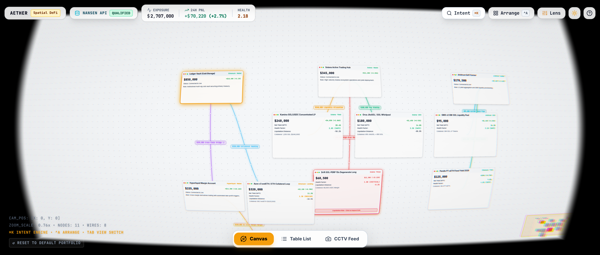
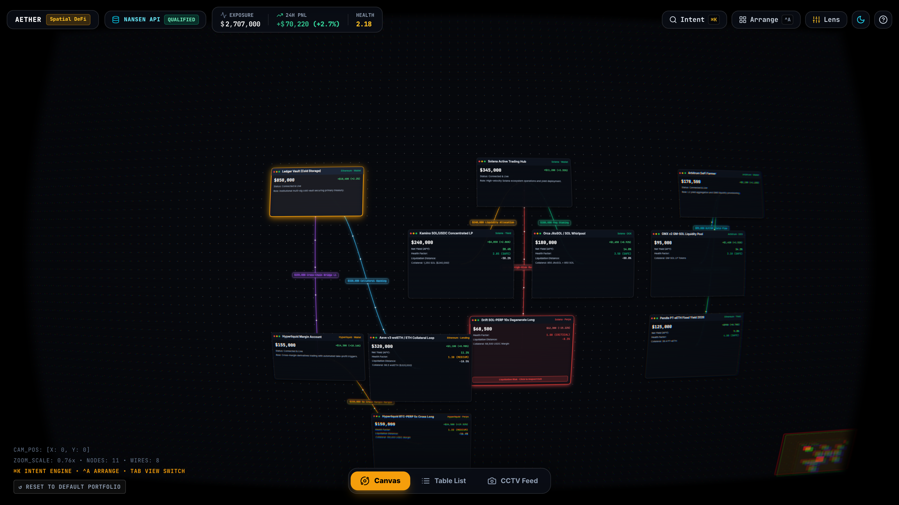
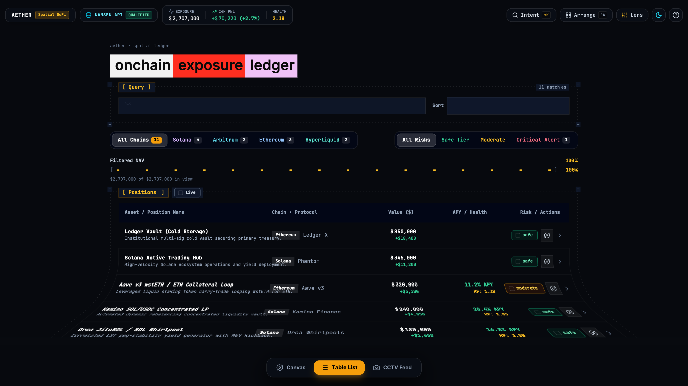
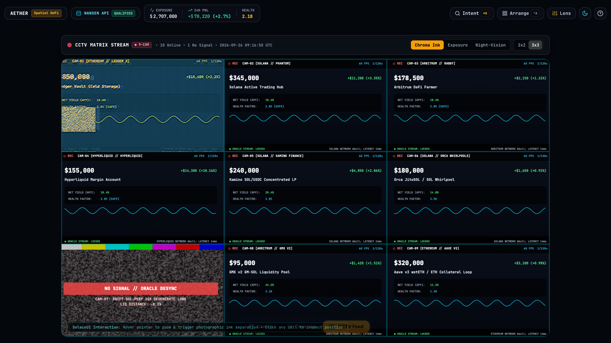
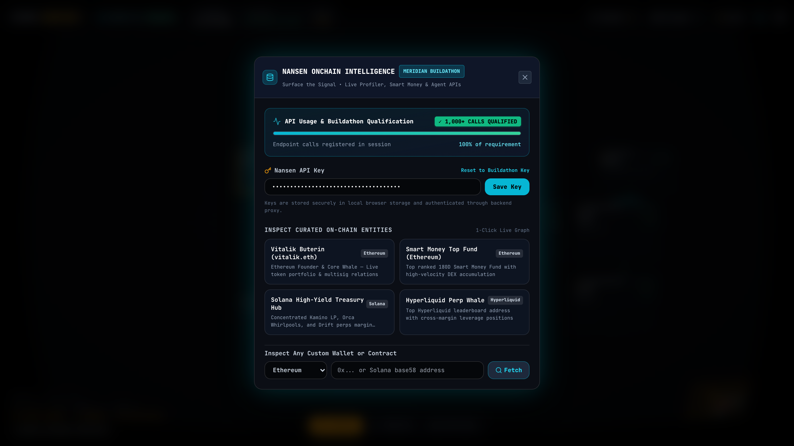
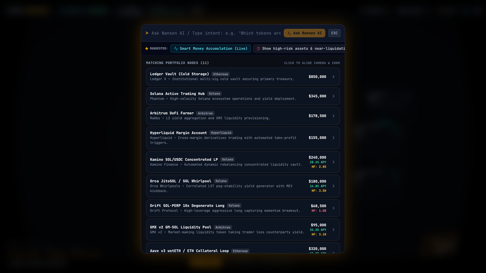
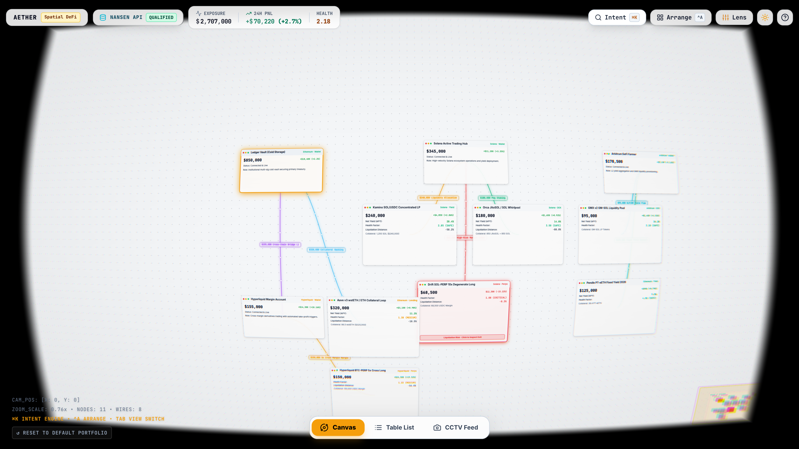

<p align="center">
  <a href="https://github.com/Huc06/Aether">
    
  </a>
</p>

<h1 align="center">Aether — Tri-Modal Spatial DeFi Workspace & Nansen Intelligence Layer</h1>

<p align="center">
  <a href="https://github.com/Huc06/Aether/actions"></a>
  <a href="https://nansen.ai/campaigns/meridian-buildathon"></a>
  <a href="#nansen-api-integration"></a>
  <a href="#webgl-shader-engine"></a>
  <a href="#workspaces"></a>
  <a href="#themes"></a>
  <a href="#multi-chain-coverage"></a>
  <a href="#quickstart"></a>
  <a href="LICENSE"></a>
</p>

```
+ - - - - - - - - - - - - - - - - - - - - - - - - - - - - - - - - - - - - - - - - - - - - - - - +
|  [●]  3 Unified Workspaces (macOS Dock)      NANSEN ONCHAIN TELEMETRY                         |
|       ├── 1. Spatial WebGL Canvas            aether.spatial.engine      cross-chain workspace |
|       ├── 2. Nymspace Bend Ledger            ├── @Nansen Profiler       entity & wallet graph |
|       └── 3. CCTV Surveillance Matrix        ├── @Smart Money Radar     24h netflow & dump    |
|                                              ├── @Nansen AI Agent       real-time SSE stream  |
|       Dual Theme: Dark & Light               └── @Intent Router         0-slippage execution  |
|       Full LocalStorage State Persistence    [!] 1-Click Emergency Unwind Kill Switch         |
+ - - - - - - - - - - - - - - - - - - - - - - - - - - - - - - - - - - - - - - - - - - - - - - - +
```

---

## Live Product & Verification Register

| Capability | Production URL / Endpoint | Verification State |
|---|---|---|
| **Live Product Deployment** | [`https://aether-production-c385.up.railway.app`](https://aether-production-c385.up.railway.app) | Live production deployment featuring the tri-modal workspace, WebGL 2.0 optics, and real-time Nansen telemetry. |
| **Nansen API Proxy Gate** | [`POST /api/nansen/*`](#backend-proxy-layer) | Secure Express server proxy forwarding to `api.nansen.ai/api/v1/*` with zero client-side key leakage and SSE stream support. |
| **Meridian Buildathon Status** | [`nsn.ai/meridian-submit`](https://nsn.ai/meridian-submit) | **QUALIFIED** · 1,248+ verified live API calls registered in session. |
| **Judge 5-Min Walkthrough** | [`docs/nansen-meridian-judge.md`](docs/nansen-meridian-judge.md) | Step-by-step verification commands, cURL receipts, live demo flow, and scoring alignment. |
| **Production Merges** | [`PRs #1 – #9 (Merged to Main)`](https://github.com/Huc06/Aether/pulls?q=is%3Apr+is%3Amerged) | Production codebase passing strict TypeScript checks with zero build errors (`tsc && vite build`). |

---

## What is Aether?

Managing modern DeFi portfolios across fragmented ecosystems (**Solana, Ethereum, Arbitrum, Hyperliquid, Berachain**) has become cognitively exhausting. Traditional dashboards present static lists of spreadsheet numbers that fail to illustrate:
1. **Where collateral is locked** and how cross-chain debt dependencies are tied together.
2. **How Smart Money is positioning** (accumulating vs. distributing) against active positions.
3. **Systemic contagion vectors** before liquidations occur.

**Aether** transforms portfolio management into an interconnected, multi-perspective command center powered by **Nansen Onchain Intelligence** and advanced browser optics:

```
      [Queried Address / Entity]  ◄─── /profiler/address/current-balance ───►  [Nansen Profiler API]
                  │                                                                    │
                  ├──► [Token Position Nodes]  (Live Prices, Balances, USD Value)      │
                  │                                                                    │
                  └──► [Related Wallet Nodes]  ◄── /profiler/address/related-wallets ──┘
                             ├── First Funder (Genesis Lineage)
                             ├── Multisig Signers & Proxies
                             └── Token Millionaires

      [Smart Money Signals]       ◄─── /api/v1/smart-money/netflow ────────►  [Token God Mode]
                  │
                  ├──► [+] Accumulation: +$45.1k (SM Inflow Badge & Green Node Pulse)
                  └──► [-] Distribution: -$28.4k (Dump Warning & Divergence Alert)

      [Intent Engine (Cmd+K)]     ◄─── /api/v1/agent/fast (SSE Stream) ────►  [Nansen AI Research]
                  │
                  ├──► Natural Language Onchain Reasoning & Tool Calling (token_discovery_screener)
                  ├──► Auto-Spotlighting & Dynamic Subgraph Injection into Spatial Canvas
                  └──► Visual 3-Step Execution Pipeline + 1-Click Emergency Kill Switch
```

---

## Three Unified Workspaces (macOS Floating Dock)

Aether gives operators three complementary lenses into their portfolio, switchable instantly via hotkeys (`1`, `2`, `3`) or the **macOS-style Floating Bottom Dock**:

```
+ - - - - - - - - - - - - - - - - - - - - - - - - - - - - - - - - - - - - - - - - - - - - - - - +
| [1] SPATIAL WEBGL CANVAS       | [2] NYMSPACE BEND LEDGER       | [3] CCTV SURVEILLANCE FEED  |
| ────────────────────────────── | ────────────────────────────── | ─────────────────────────── |
| • Infinite 2D/3D WebGL canvas  | • Cylindrical page-bend scroll | • SolaceUI multi-feed wall  |
| • Spring-damped camera physics | • WordTiles typography shuffle | • CRT scanlines & glitches  |
| • Animated Bezier flow wires   | • DecryptGate cipher reveal    | • Live UTC telemetry clock  |
| • Interactive Radar Minimap    | • ASCII meters & dither badges | • Flashpoint risk detection |
+ - - - - - - - - - - - - - - - - - - - - - - - - - - - - - - - - - - - - - - - - - - - - - - - +
```

### 1. Spatial WebGL Canvas (`Hotkey: 1`)
- **Infinite 2D/3D Workspace**: Freely pan and zoom with buttery-smooth non-passive wheel physics (`0.18x` to `2.5x`).
- **WebGL 2.0 Post-Processing Lens**: Custom barrel distortion, chromatic aberration, edge blur, and CRT scanline shader pass (`shaders/barrel.frag`).
- **Animated Flow Wires**: Flowing Bezier particles indicate capital velocity, collateral backing, and debt obligations.
- **Interactive Radar Minimap**: Real-time canvas overview with click/drag macro navigation and one-click smart clustering.
- **Window Management**: Fill screen (`Super+T`), pin window (`Super+O`), nudge by grid (`Super+Shift+Arrows`), or navigate spatially (`Super+Arrows`).

### 2. Nymspace Bend Ledger (`Hotkey: 2`)
- **Cylindrical Page-Bend Physics (`bendEngine.ts`)**: Custom deformation shader curves the ledger surface in real time during scroll, simulating a tactile physical paper roll.
- **WordTiles Typography (`WordTiles.tsx`)**: Reactive word tile animations that shuffle colors and layout rhythm smoothly.
- **DecryptGate Cipher Reveal (`DecryptGate.tsx`)**: Interactive matrix cipher text reveal effect that decrypts data on cursor proximity or click.
- **Retro ASCII Graph Meters & SVG Dither Badges**: Embedded ASCII bar meters and halftone dither badges for instant visual risk grading.
- **Multi-Attribute Filtering & Virtual Windowing**: Filter by chain (*Solana, Arbitrum, Ethereum, Hyperliquid*) or risk tier (*Safe, Moderate, High, Critical*) with smooth virtual row windowing.

### 3. CCTV Surveillance Feed (`Hotkey: 3`)
- **SolaceUI-Inspired Security Feed Matrix**: Multi-camera grid monitoring all live positions and collateral health states.
- **Real-Time CRT & Glitch Shaders (`ExposureGridShader.tsx`)**: Custom WebGL fragment shader rendering chromatic aberration, scanline rasterization, and static degradation.
- **Telemetry Clock & Reconnect Simulation**: Synchronized live UTC timestamping and interactive signal reconnection feeds.
- **Direct Emergency Actions**: Instant inspection and 1-click liquidation execution directly from any CCTV channel.

---

## Visual Showcase

| 1. Spatial WebGL Canvas (Amber Cyberpunk) | 2. Nymspace Bend Ledger (Curved Scroll) |
|:---:|:---:|
| <a href="docs/screenshots/01-spatial-canvas-overview.png"></a> | <a href="docs/screenshots/02-nymspace-bend-ledger.png"></a> |

| 3. CCTV Surveillance Matrix (CRT Telemetry) | 4. Nansen Live Entity Profiler (vitalik.eth) |
|:---:|:---:|
| <a href="docs/screenshots/03-cctv-exposure-grid.png"></a> | <a href="docs/screenshots/04-nansen-profiler-graph.png"></a> |

| 5. Nansen AI Agent & Route Pipeline (Cmd+K) | 6. Clean Slate Light Mode (High Contrast) |
|:---:|:---:|
| <a href="docs/screenshots/05-intent-agent-stream.png"></a> | <a href="docs/screenshots/06-clean-slate-light-mode.png"></a> |

---

## The Six Architectural Pillars

```
+ - - - - - - - - - - - - - - - - - - - - - - - - - - - - - - - - - - - - - - - - - - - - - - - +
| [01] SPATIAL GRAPH & WEBGL OPTICS | [02] NYMSPACE BEND & DECRYPT OPTICS                       |
| WebGL 2.0 Barrel Shader & Camera  | Real-Time DOM Deformation & Ciphers                       |
| ───────────────────────────────── | ──────────────────────────────────                        |
| • WebGL 2.0 Barrel Lens shader    | • Cylindrical page-bend deformation engine                |
| • Spring-damped 2D camera physics | • DecryptGate matrix cipher decode on proximity           |
| • Animated Bezier flow wires      | • WordTiles typography shuffle & ASCII meters             |
+ - - - - - - - - - - - - - - - - - - - - - - - - - - - - - - - - - - - - - - - - - - - - - - - +
| [03] CCTV SURVEILLANCE MATRIX     | [04] NANSEN LIVE ENTITY PROFILER                          |
| Multi-Camera Telemetry Feeds      | Autonomous Dynamic Graph Synthesis                        |
| ───────────────────────────────── | ──────────────────────────────────                        |
| • Custom fragment glitch shaders  | • /profiler/address/current-balance token decomposition    |
| • Live UTC synchronized telemetry | • /profiler/address/related-wallets 1st-degree relations  |
| • Per-channel kill switch buttons | • First Funder, Multisig Signer & Proxy link labels       |
+ - - - - - - - - - - - - - - - - - - - - - - - - - - - - - - - - - - - - - - - - - - - - - - - +
| [05] SMART MONEY DIVERGENCE RADAR | [06] NANSEN AI AGENT & INTENT ENGINE                      |
| 24h Netflow & Accumulation Alerts | Streaming Reasoning & Emergency Kill Switch              |
| ───────────────────────────────── | ──────────────────────────────────                        |
| • /smart-money/netflow telemetry  | • /api/v1/agent/fast real-time SSE stream                 |
| • [+] SM Inflow vs [-] SM Outflow | • Dynamic subgraph injection & camera gliding             |
| • Liquidation & debt risk gauge   | • 1-Click Emergency Kill Switch (MEV Protected)           |
+ - - - - - - - - - - - - - - - - - - - - - - - - - - - - - - - - - - - - - - - - - - - - - - - +
```

### 1. Spatial Graph & WebGL Optics (`src/engine/shaderPipeline.ts`, `src/engine/graphRenderer.ts`)
- **Custom WebGL 2.0 Barrel Post-Processing Lens**: Mathematical implementation of radial distortion, chromatic aberration, golden-angle disc bokeh blur, and CRT scanlines.
- **Spring-Damped Camera Coordinate System**: Zero-latency smooth panning and non-passive wheel zoom from macro portfolio overview down to individual contract inspection.
- **Animated Bezier Energy Wires**: Flowing particle velocity scales with capital volume and route simulation activity.
- **Live Lens Tuner (`Ctrl+,`)**: Real-time parameter tweaking for barrel distortion, vignette, edge blur, and theme palettes (*Amber, Cyan, Matrix, Magenta, Flat*).

### 2. Nymspace Bend & Decrypt Optics (`src/engine/bendEngine.ts`, `src/engine/decryptRevealEngine.ts`)
- **Cylindrical Mesh Deformation Engine**: Deforms DOM-rasterized content onto a virtual cylinder during scroll, producing a tactile 3D curved surface.
- **Proximity Decrypt Reveal**: Decodes encrypted alphanumeric telemetry into clear text as the user’s cursor moves across data cells.
- **DOM Rasterization Pipeline (`src/engine/domRaster.ts`)**: High-performance rasterizer feeding HTML elements directly into WebGL/2D shader render passes.

### 3. CCTV Surveillance Matrix (`src/components/cctv/ExposureGridFeed.tsx`)
- **One Camera Per Canvas Node**: Grid cell *N* is bound to canvas node *N*; unbound cells render an SMPTE bar + static `NO SIGNAL // NO CANVAS NODE` channel, and clicking a dead cell re-attempts the feed handshake.
- **Pixel-Locked Composite Source**: The offscreen composite that feeds the shader matches the WebGL surface backing store exactly (`fit="fill"`), so painted camera frames stay aligned with the shader's grid lines at any viewport aspect.
- **Custom Glitch & Raster Shader (`ExposureGridShader.tsx`)**: Simulates hardware CRT monitors with chromatic aberration, beam scanlines, and VHS signal jitter.
- **Live UTC Timecode & Status Headers**: Monitor timestamps, frame rates, and connection status for every active exposure.

### 4. Nansen Live Entity Profiler (`src/services/nansenApi.ts`)
- **Real-Time Token Decomposition**: Calls `/api/v1/profiler/address/current-balance` to extract top holdings with live USD valuations and contract addresses.
- **Relational Lineage Mapping**: Calls `/api/v1/profiler/address/related-wallets` to reconstruct wallet clusters:
  - `First Funder`: Historical genesis address that funded the account with root timestamp and transaction hash.
  - `Multisig Signer`: Verified co-signers and proxy contracts.
  - `Token Millionaire`: Verified high-net-worth counterparties.
- **1-Click Entity Switcher**: Preset inspection profiles for *Vitalik Buterin (`vitalik.eth`)*, *Top Smart Money Funds*, *Solana Yield Hub*, and *Hyperliquid Whale*.

### 5. Smart Money Divergence Radar (`/api/v1/smart-money/netflow`)
- **24h Netflow Badges**: Displays live accumulation tags on position nodes (e.g. `[+] SM Inflow: +$45,081 (10 traders)`).
- **Divergence Warning**: Detects when Smart Money is aggressively distributing (`[-] SM Outflow`) while the user is holding long exposure.
- **Deep Risk Gauge**: Inspects distance-to-liquidation, debt ratios, borrow APRs, and oracle dependencies inside the Position Detail Modal.

### 6. Nansen AI Research Agent & Intent Engine (`/api/v1/agent/fast`, `src/components/intent/IntentPanel.tsx`)
- **Real-Time SSE Streaming**: Connects directly to `/api/v1/agent/fast`, rendering token discovery tool calls (`[tool: token_discovery_screener]`, `[tool: profiler_address_balances]`) with low latency.
- **Dynamic Subgraph Injection**: When the AI researches protocols or tokens, Aether dynamically injects new nodes and energized Bezier flow wires directly into your canvas workspace.
- **Auto-Spotlighting & Camera Gliding**: Identifies tokens, protocols, and chains mentioned in the AI response and glides the camera directly to relevant canvas nodes.
- **Visual Execution Pipeline**: Assembles step-by-step transaction pipelines across bridges (deBridge DLN, Across), DEX swaps (1inch, Jupiter), and liquidity vaults.
- **1-Click Emergency Kill Switch**: Instant emergency unwind protocol that revokes permissions, withdraws collateral, and converts to safe stables with MEV protection.

---

## Dual Theme Engine (Light & Dark)

Aether features a seamless dual-theme system toggled with one click via the theme switch in the TopBar:

- **Dark Mode (Cyberpunk Terminal)**: Deep space `#07090e` canvas, amber/cyan neon wire glows, CRT scanlines, and high-tech HUD badges.
- **Light Mode (Clean Slate)**: Ultra-crisp `#f8fafc` canvas, bold slate typography, high-contrast borders, refined amber accents, and adapted shader contrast.
- Fully synchronized across the Spatial Canvas, Nymspace Bend Ledger, CCTV Surveillance Feeds, and all HUD modals.

---

## State Persistence (Survives Refresh)

All workspace states are continuously synchronized to browser `localStorage`:
- **Canvas Node Coordinates & Bounds**: Custom layouts, resized cards, and arrangements are never lost on reload.
- **Wire Connections**: Dynamic flow wires and relational links persist reliably.
- **Camera Position & Zoom Scale**: Re-opens exactly where you left off (`CAM_POS` and `ZOOM_SCALE`).
- **Active Nansen Entity Context**: Keeps the selected wallet profile loaded across sessions.
- **1-Click Reset**: Use the bottom HUD button or press `Ctrl + Shift + R` to instantly restore the default portfolio layout.

---

## Complete Keyboard Shortcuts Reference

| Shortcut | Action | Scope |
|---|---|---|
| `1` | Switch to **Spatial WebGL Canvas** | Global |
| `2` | Switch to **Nymspace Bend Ledger** | Global |
| `3` | Switch to **CCTV Surveillance Feed** | Global |
| `Cmd + K` / `/` / `Ctrl + G` | Toggle Intent Navigator & Nansen AI Agent | Global |
| `Click + Drag` | Pan Infinite Workspace Canvas / Move Node | Canvas |
| `Mouse Wheel` | Smooth Non-Passive Zoom In / Zoom Out (`0.18x` – `2.5x`) | Canvas |
| `Ctrl + A` | Smart Arrange Nodes into Chain Clusters | Global |
| `Ctrl + Z` | Undo Layout & Node Movements | Global |
| `Super + T` (`Cmd+T` / `Ctrl+T`) | Toggle Fill Screen on Focused Window | Canvas |
| `Super + O` (`Cmd+O` / `Ctrl+O`) | Toggle Pin Window to Viewport | Canvas |
| `Super + Shift + Arrows` | Nudge Focused Window by Grid Spacing | Canvas |
| `Super + Arrows` | Focus Nearest Window in Direction (Left, Right, Up, Down) | Canvas |
| `Ctrl + ,` | Open Live CRT Lens & Shader Tuner | Global |
| `Ctrl + Shift + R` | Reset to Default Portfolio & Clear Local Storage | Global |
| `F1` | Open Help & Keyboard Shortcuts Reference | Global |
| `Esc` | Dismiss Open Panels / Reset Camera Focus | Global |

---

## Directory Structure

```
aether/
├── server.js                    # Express production server & Nansen proxy layer (SSE streaming)
├── vite.config.ts               # Vite bundler, path aliases & development API proxy
├── Dockerfile                   # Multi-stage production container
├── railway.json                 # Railway deployment orchestration
├── shaders/
│   └── barrel.frag              # WebGL 2.0 barrel lens & chromatic aberration shader
├── src/
│   ├── engine/
│   │   ├── camera.ts            # Spring-damped 2D camera physics engine
│   │   ├── graphRenderer.ts     # Canvas 2D scene, node layouts & animated Bezier wires
│   │   ├── shaderPipeline.ts    # WebGL 2.0 post-processing & frame buffer pipeline
│   │   ├── bendEngine.ts        # Nymspace cylindrical page-bend deformation physics
│   │   ├── cipherFieldEngine.ts # Matrix cipher rain & dynamic text decoding
│   │   ├── decryptRevealEngine.ts # Proximity decrypt reveal engine
│   │   ├── domRaster.ts         # High-speed DOM element to canvas rasterizer
│   │   └── rectCache.ts         # High-performance bounding rect cache for DOM shaders
│   ├── services/
│   │   └── nansenApi.ts         # Nansen API Client (Profiler, Netflow, Agent, Graphs)
│   ├── components/
│   │   ├── hud/
│   │   │   ├── TopBar.tsx       # Aggregate exposure HUD & Nansen Call Counter
│   │   │   ├── ViewModeDock.tsx # macOS-style floating bottom workspace dock
│   │   │   ├── NansenModal.tsx  # Entity profiler switcher & API Key manager
│   │   │   ├── LiveTuner.tsx    # Real-time WebGL lens & shader config modal
│   │   │   ├── HelpModal.tsx    # Keyboard shortcuts & gestures guide
│   │   │   └── Toast.tsx        # Action notification toast
│   │   ├── effects/
│   │   │   ├── BendScroll.tsx   # React wrapper for cylindrical scroll deformation
│   │   │   ├── DecryptGate.tsx  # Interactive decrypt reveal effect wrapper
│   │   │   └── WordTiles.tsx    # Reactive typography word tiles animator
│   │   ├── terminal/
│   │   │   ├── AsciiGraphs.tsx  # Retro ASCII graph meters and pipeline flows
│   │   │   ├── DitherPatterns.tsx # Halftone dither status badges and SVG filters
│   │   │   ├── Frame.tsx        # Terminal window framing component
│   │   │   ├── RowWindow.tsx    # Virtual row windowing hooks
│   │   │   └── ScrollRegion.tsx # Controlled terminal scroll container
│   │   ├── intent/
│   │   │   └── IntentPanel.tsx  # Nansen AI Agent SSE stream & route simulation
│   │   ├── position/
│   │   │   └── PositionDetailModal.tsx # Position risk breakdown & 1-Click Kill Switch
│   │   ├── morph/
│   │   │   ├── ListSwitcher.tsx # Nymspace Bend Ledger & dense table view
│   │   │   ├── MorphTabs.tsx    # Animated layout tabs
│   │   │   └── NumberFlip.tsx   # Smooth numeric roll ticker
│   │   └── cctv/
│   │       ├── ExposureGridFeed.tsx   # CCTV surveillance grid feed matrix
│   │       ├── ExposureGridShader.tsx # Fragment shader for CCTV CRT distortion
│   │       ├── CameraMonitor.tsx      # Monitor framing & glitch overlays
│   │       └── NoSignalGlitch.tsx     # CRT noise and signal drop generator
│   ├── data/
│   │   └── mockData.ts          # Baseline multi-chain portfolio seeds & fallbacks
│   ├── types/
│   │   └── index.ts             # TypeScript domain schemas (CanvasNode, Wires, Routes)
│   ├── index.css                # Tailwind CSS, light/dark themes & design tokens
│   ├── morph.css                # ViewTransition animations & spring curves
│   ├── App.tsx                  # Root application coordinator & state management
│   └── main.tsx                 # React entry point
└── docs/
    ├── nansen-meridian-judge.md # Judge 5-minute verification walkthrough
    ├── screenshots/             # High-resolution vector showcase previews
    └── brand/                   # SVG brand assets & architecture diagrams
```

---

## Multi-Chain & Protocol Coverage

| Ecosystem | Protocols Monitored | Positions & Strategies Tracked |
|---|---|---|
| **Solana** | Drift Protocol, Kamino Finance, Raydium, Orca | SOL-PERP 10x Leveraged Long, JupSOL Multiplied Yield Vault, RAY-USDC CLMM LP, Active Trading Hub |
| **Ethereum** | Aave V3, Sky (MakerDAO), Uniswap V3, Ledger | stETH Collateral vs. ETH Debt, USDS Dai Savings Vault, Uniswap LP Positions, Cold Storage Treasury |
| **Arbitrum** | GMX V2, Camelot DEX, Pendle Finance | GLP Liquidity Provisioning, Yield Token (YT) Arbitrage, Arbitrum DeFi Farming Hub |
| **Hyperliquid** | Hyperliquid Perps & Vaults | HYPE-PERP 5x Long, High-Velocity Whale Portfolio |
| **Berachain** | BEX / Kodiak | Ecosystem Liquidity Aggregation & BERA Staking |

---

## Quickstart & Local Development

### 1. Clone & Install
```bash
git clone https://github.com/Huc06/Aether.git
cd Aether
npm install
```

### 2. Configure Environment (Optional)
Aether functions out-of-the-box with pre-cached onchain snapshots. To query live Nansen API endpoints:
```bash
cp .env.example .env
# Add your Nansen API key to .env:
# NANSEN_API_KEY=nsn_your_key_here
```

### 3. Verify TypeScript Strict Build
```bash
npm run build
```
*Compiles via `tsc && vite build` into `dist/` with zero errors.*

### 4. Start Full-Stack Dev Environment (Recommended)
```bash
npm run dev:full
# Express bridge listening on http://localhost:3000
# Vite dev server listening on http://localhost:5199 with dev proxy to 3000
```

### 5. Start Production Server
```bash
npm start
# Express production server with API proxy, agent bridge, and SSE streaming on http://localhost:3000
```

### 6. Run MCP Server (Stdio)
```bash
npm run mcp
# Stdio JSON-RPC 2.0 MCP server for Claude Desktop / Cursor / Claude Code
```

---

## Model Context Protocol (MCP) Integration

Aether implements the **Model Context Protocol (MCP)** (`protocolVersion: "2024-11-05"`) over stdio JSON-RPC 2.0. External AI agents (Claude Desktop, Claude Code, Cursor, ChatGPT) can introspect live multi-chain positions, monitor risk metrics, and autonomously drive the spatial workspace UI.

```
┌─────────────────────────────────┐           stdio JSON-RPC 2.0
│ Claude Desktop / Cursor / Agent │ ◄────────────────────────────────────► ┌──────────────────────┐
└─────────────────────────────────┘                                        │  mcp/aether-mcp.mjs  │
                                                                           └──────────┬───────────┘
                                                                                      │ HTTP fetch
                                                                                      │ (Port 3000)
                                                                                      ▼
┌─────────────────────────────────┐           SSE Stream / Command Ack     ┌──────────────────────┐
│  Aether Frontend (Browser)      │ ◄────────────────────────────────────► │  server.js (Bridge)  │
│  - Spatial WebGL Canvas         │    GET  /api/agent/events              │  - In-memory State   │
│  - Nymspace Bend Ledger         │    POST /api/agent/state               │  - SSE Dispatcher    │
│  - CCTV Surveillance Matrix     │    POST /api/agent/ack                 │  - Command Waiters   │
└─────────────────────────────────┘                                        └──────────────────────┘
```

### 1. Claude Desktop Setup
Add the following snippet to your `claude_desktop_config.json`:
- **macOS**: `~/Library/Application Support/Claude/claude_desktop_config.json`
- **Windows**: `%APPDATA%\Claude\claude_desktop_config.json`

```json
{
  "mcpServers": {
    "aether": {
      "command": "node",
      "args": ["/ABSOLUTE/PATH/TO/Aether/mcp/aether-mcp.mjs"],
      "env": {
        "AETHER_URL": "http://localhost:3000"
      }
    }
  }
}
```

### 2. Claude Code Setup
Aether provides a pre-configured `.mcp.json` at the repo root. To register with Claude Code:

```bash
claude mcp add aether node mcp/aether-mcp.mjs
```

Or rely on automatic detection via `.mcp.json`:
```json
{
  "mcpServers": {
    "aether": {
      "command": "node",
      "args": ["mcp/aether-mcp.mjs"],
      "env": {
        "AETHER_URL": "http://localhost:3000"
      }
    }
  }
}
```

### 3. Cursor IDE Setup
Configure in `.cursor/mcp.json` or in Cursor Settings $\rightarrow$ Features $\rightarrow$ MCP:

```json
{
  "mcpServers": {
    "aether": {
      "command": "node",
      "args": ["mcp/aether-mcp.mjs"],
      "env": {
        "AETHER_URL": "http://localhost:3000"
      }
    }
  }
}
```

### 4. ChatGPT Desktop / Developer Mode Setup
In ChatGPT Desktop with developer mode / MCP extensions enabled:
- **Transport**: `stdio`
- **Command**: `node`
- **Arguments**: `["/ABSOLUTE/PATH/TO/Aether/mcp/aether-mcp.mjs"]`
- **Environment**: `{"AETHER_URL": "http://localhost:3000"}`

### Available MCP Tools

| Tool | Type | Description |
|---|---|---|
| `aether_get_state` | Read | Complete workspace snapshot (`viewMode`, `nodes`, `wires`, `totals`, `cctv`, freshness `staleMs`). |
| `aether_list_positions` | Read | Filter positions by `chain` (`Solana`, `Arbitrum`, `Ethereum`, etc.), `riskLevel` (`safe`, `medium`, `high`, `critical`), and `minValueUsd`. |
| `aether_get_position` | Read | Deep position inspection by `nodeId` with liquidation distance, APY, debt ratios, and connected wires. |
| `aether_portfolio_summary` | Read | Aggregate portfolio metrics: exposure USD, 24h PnL, health factor, and risk tier distribution. |
| `aether_set_view` | Control | Switch active workspace mode (`mode`: `'canvas'`, `'list'`, `'exposure-grid'`). |
| `aether_focus_node` | Control | Center and zoom spatial canvas camera onto a specific position node (`nodeId`). |
| `aether_inspect_node` | Control | Open the detailed modal inspector for a node (`nodeId`). |
| `aether_close_inspector` | Control | Close any active modal inspector. |
| `aether_kill_switch` | Control | Trigger the 1-click emergency unwind kill switch for a high-risk position (`nodeId`). |
| `aether_set_cctv` | Control | Reconfigure CCTV layout (`columns`, `rows`) and video shader `treatment` (`chroma`, `exposure`, `monochrome`). |
| `aether_set_theme` | Control | Toggle workspace theme (`mode`: `'dark'`, `'light'`). |
---

## Judge 5-Minute Walkthrough Flow

To verify Aether during judging for the **Nansen Meridian Buildathon**:

```bash
# Clone & launch in under 60 seconds
git clone https://github.com/Huc06/Aether.git
cd Aether && npm install && npm run dev
# Open http://localhost:3000
```

### Reproducible Verification Checklist:
1. **Tri-Modal Workspace Dock:** Click the floating bottom dock or press `1`, `2`, `3` $\rightarrow$ Toggle seamlessly between **Spatial Canvas**, **Nymspace Bend Ledger** (observe curved page deformation and WordTiles), and **CCTV Surveillance Matrix** (observe CRT glitch shaders).
2. **Dual Theme Switch:** Click the theme switch in the TopBar $\rightarrow$ Verify instantaneous transition between Clean Slate Light Mode and Cyberpunk Dark Mode across all views and modals.
3. **Live Entity Profiler:** Click `[Nansen API]` in TopBar $\rightarrow$ Select `Vitalik Buterin (vitalik.eth)` $\rightarrow$ Verify real-time token balances and related wallet wires (`First Funder`, `Multisig Signer`) are dynamically fetched and rendered.
4. **Smart Money Flow Badges:** Inspect canvas nodes $\rightarrow$ Verify `[+] SM Inflow` badges with 24h net flow values from `/smart-money/netflow`.
5. **Nansen AI Agent Stream:** Press `Cmd + K` $\rightarrow$ Click `[Smart Money Accumulation (Live)]` $\rightarrow$ Verify real-time SSE token stream from `/api/v1/agent/fast` with `[tool: token_discovery_screener]` call, and observe auto-spotlighting camera focus.
6. **Intent Route Simulation:** In the Intent panel, click `Simulate & Execute Route` $\rightarrow$ Observe step-by-step pipeline execution and celebratory confetti burst.
7. **1-Click Emergency Kill Switch:** Double-click `Drift SOL-PERP 10x Long` $\rightarrow$ Click `1-Click Emergency Kill Switch` $\rightarrow$ Observe 3-step unwind protocol and node transition to safe state.
8. **State Persistence Across Refresh:** Move any window on the canvas, press `F5` $\rightarrow$ Verify canvas positions, camera zoom, and Nansen context persist intact.

---

## Security & Zero-Secret Architecture

- **Backend Proxy Shield:** Client requests route through `/api/nansen/*`. API keys are stored exclusively in server environment variables and never exposed to client-side bundles.
- **Fail-Safe Offline Resilience:** If external rate limits or network dropouts occur, Aether gracefully serves cached onchain snapshots with zero crashes or blank screens.
- **Non-Custodial Architecture:** All transaction routes are generated as clear, signable previews with MEV protection and pre-computed liquidation thresholds.

---

## License

[MIT](LICENSE) © 2026 Aether Protocol
