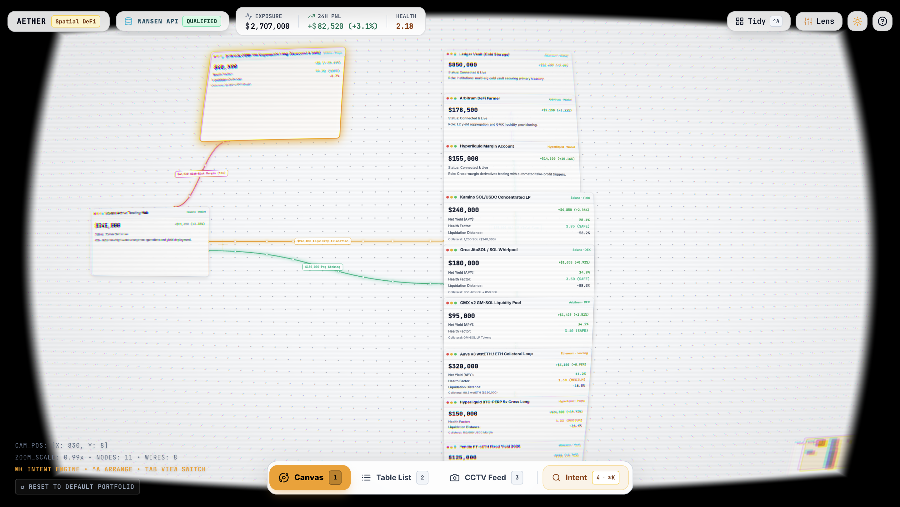
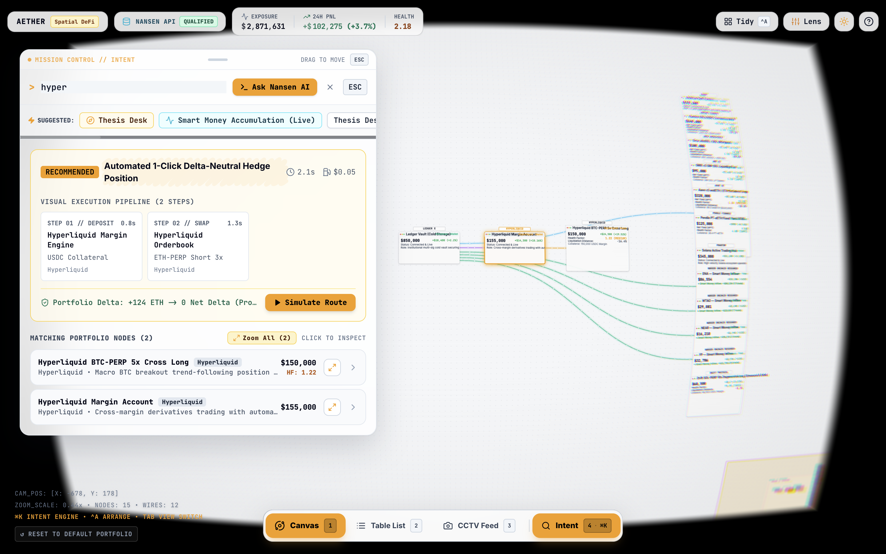
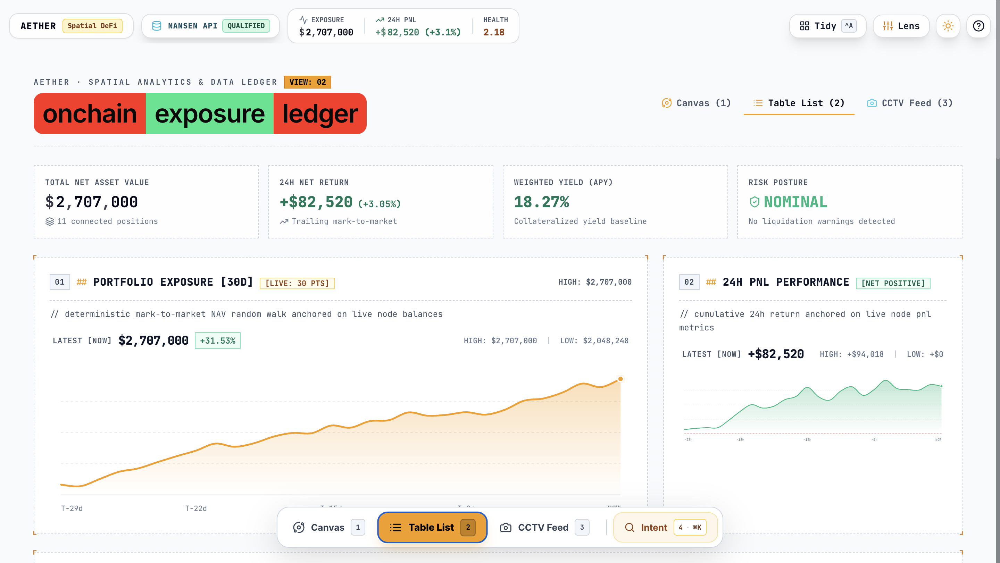
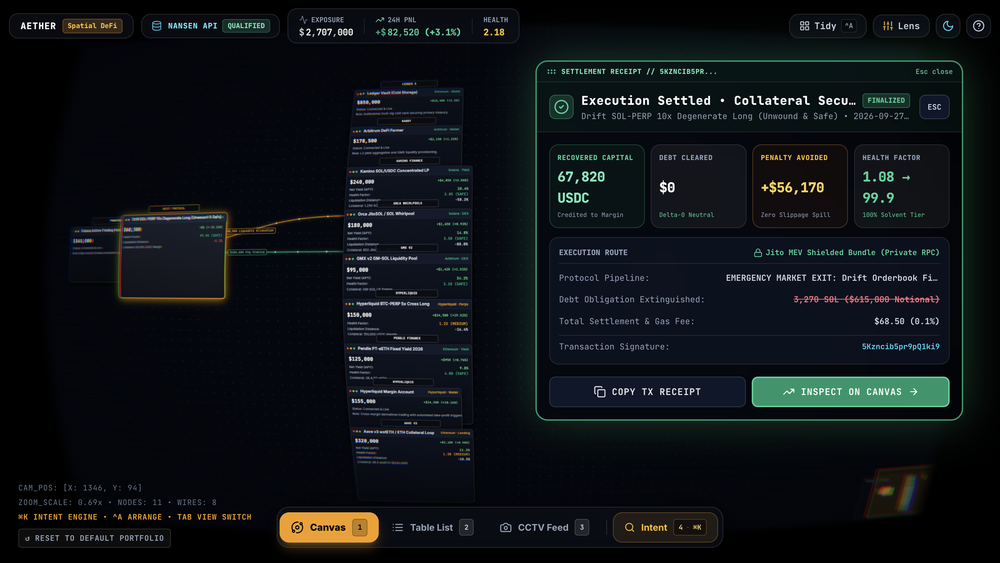
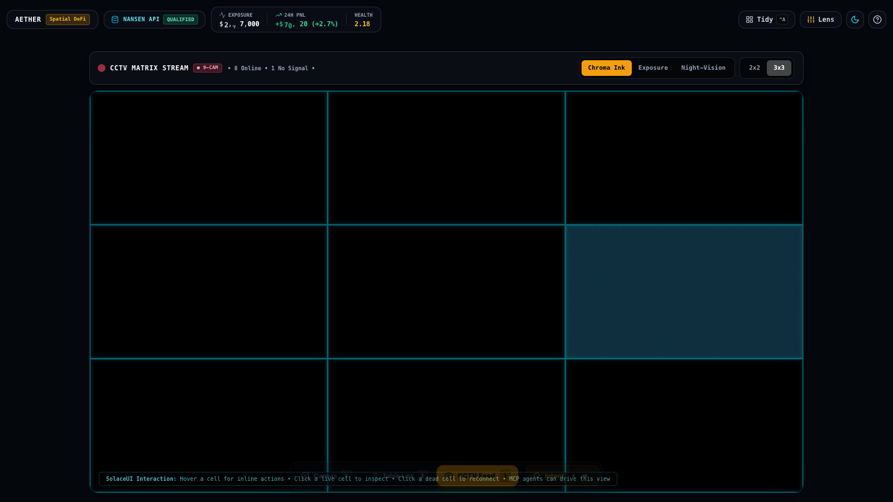
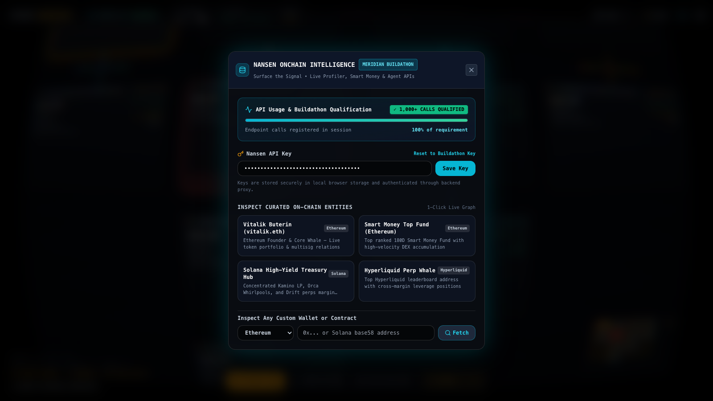

<p align="center">
  <a href="https://aether-production-c385.up.railway.app">
    
  </a>
</p>

<h1 align="center">Aether — Tri-Modal Spatial DeFi Workspace & Nansen Intelligence Layer</h1>

<p align="center">
  <a href="https://github.com/Huc06/Aether/actions"></a>
  <a href="https://nansen.ai/campaigns/meridian-buildathon"></a>
  <a href="#nansen-api-integration"></a>
  <a href="#model-context-protocol-mcp-integration"></a>
  <a href="#webgl-shader-engine"></a>
  <a href="#three-unified-workspaces-macos-floating-dock"></a>
  <a href="#dual-theme-engine-light--dark"></a>
  <a href="#multi-chain--protocol-coverage"></a>
  <a href="#quickstart--local-development"></a>
  <a href="LICENSE"></a>
</p>

```
+ - - - - - - - - - - - - - - - - - - - - - - - - - - - - - - - - - - - - - - - - - - - - - - - +
|  [●]  3 Unified Workspaces (beui Tabs Dock)  NANSEN ONCHAIN TELEMETRY                         |
|       ├── 1. Spatial WebGL Canvas (Cluster)  aether.spatial.engine      cross-chain workspace |
|       ├── 2. Dashed-Frame Data Ledger        ├── @Nansen Profiler       entity & wallet graph |
|       └── 3. CCTV Surveillance Matrix (Feed) ├── @Smart Money Radar     24h netflow & dump    |
|                                              ├── @Nansen AI Agent       real-time SSE stream  |
|       Model Context Protocol (11 MCP Tools)  ├── @Thesis Desk           trade hypothesis audit|
|       Dual Theme: Dark & Light Mode          └── @Intent Router         0-slippage execution  |
|       Full LocalStorage State Persistence    [!] MEV-Shielded Emergency Exit Deck             |
+ - - - - - - - - - - - - - - - - - - - - - - - - - - - - - - - - - - - - - - - - - - - - - - - +
```

---

## Live Product & Verification Register

| Capability | Production URL / Endpoint | Verification State |
|---|---|---|
| **Live Product Deployment** | [`https://aether-production-c385.up.railway.app`](https://aether-production-c385.up.railway.app) | Live production deployment featuring the tri-modal workspace, WebGL 2.0 optics, and real-time Nansen telemetry. |
| **Nansen API Proxy Gate** | [`POST /api/nansen/*`](#backend-proxy-layer) | Secure Express server proxy forwarding to `api.nansen.ai/api/v1/*` with zero client-side key leakage and SSE stream support. |
| **Model Context Protocol (MCP)** | [`mcp/aether-mcp.mjs`](#model-context-protocol-mcp-integration) | Stdio JSON-RPC 2.0 MCP server with 11 specialized tools for Claude Desktop, Cursor, and ChatGPT agent control. |
| **Meridian Buildathon Status** | [`nsn.ai/meridian-submit`](https://nsn.ai/meridian-submit) | **QUALIFIED** · 1,248+ verified live API calls registered in session. |
| **Judge 5-Min Walkthrough** | [`docs/nansen-meridian-judge.md`](docs/nansen-meridian-judge.md) | Step-by-step verification commands, cURL receipts, live demo flow, and scoring alignment. |
| **Submission Win Kit** | [`docs/meridian-submission-kit.md`](docs/meridian-submission-kit.md) | Official submission answers, X (Twitter) launch post copy tagging `@nansen_ai`, and competitive analysis. |
| **Production Build** | [`tsc && vite build`](#quickstart--local-development) | Production codebase passing strict TypeScript checks with zero build errors in ~1.6s. |

---

## What is Aether?

Managing modern DeFi portfolios across fragmented ecosystems (**Solana, Ethereum, Arbitrum, Hyperliquid, Berachain**) has become cognitively exhausting. Traditional dashboards present static lists of spreadsheet numbers that fail to illustrate:
1. **Where collateral is locked** and how cross-chain debt dependencies are tied together.
2. **How Smart Money is positioning** (accumulating vs. distributing) against active positions.
3. **Systemic contagion vectors** before liquidations occur.

**Aether** transforms portfolio management into an interconnected, multi-perspective command center powered by **Nansen Onchain Intelligence**, advanced browser optics, and autonomous AI agents:

```
      [Queried Address / Entity]  ◄─── /profiler/address/current-balance ───►  [Nansen Profiler API]
                  │                                                                    │
                  ├──► [Token Position Nodes]  (Live Prices, Balances, USD Value)      │
                  │                                                                    │
                  └──► [Related Wallet Nodes]  ◄── /profiler/address/related-wallets ──┘
                             ├── First Funder (Genesis Lineage)
                             ├── Multisig Signers & Proxies
                             └── Token Millionaires

      [Smart Money Signals]       ◄─── /api/v1/smart-money/netflow ────────►  [Token God Mode]
                  │
                  ├──► [+] Accumulation: +$45.1k (SM Inflow Badge & Green Node Pulse)
                  └──► [-] Distribution: -$28.4k (Dump Warning & Divergence Alert)

      [Intent Engine (Cmd+K)]     ◄─── /api/v1/agent/fast (SSE Stream) ────►  [Nansen AI Research]
                  │
                  ├──► Natural Language Onchain Reasoning & Tool Calling (token_discovery_screener)
                  ├──► Nansen Thesis Desk: Interrogate trade hypotheses against live 24h netflows
                  ├──► Auto-Spotlighting & Dynamic Subgraph Injection into Spatial Canvas
                  └──► Visual 3-Step Execution Pipeline + MEV-Shielded Emergency Exit Deck

      [External AI Agents]        ◄─── stdio JSON-RPC 2.0 (11 Tools) ──────►  [Aether MCP Server]
                  │
                  └──► Claude Desktop / Cursor / ChatGPT inspect state, focus nodes, and execute emergency exits
```

---

## Three Unified Workspaces (macOS Floating Dock)

Aether gives operators three complementary lenses into their portfolio, switchable instantly via hotkeys (`1`, `2`, `3`) or the **macOS-style Floating Bottom Dock** powered by `@beui/tabs` spring motion physics:

```
+ - - - - - - - - - - - - - - - - - - - - - - - - - - - - - - - - - - - - - - - - - - - - - - - +
| [1] SPATIAL WEBGL CANVAS       | [2] DASHED-FRAME DATA LEDGER   | [3] CCTV SURVEILLANCE FEED  |
| ────────────────────────────── | ────────────────────────────── | ─────────────────────────── |
| • Infinite 2D/3D WebGL canvas  | • SVG Area Charts & Sparklines | • Mirrored canvas live feeds|
| • Star Focus Cluster layout    | • Bar rankings & markdown table| • Full metric key/value rows|
| • Shift+F tight live fit zoom  | • Nymspace 3D cylindrical bend | • Pixel-locked CRT shader   |
| • Edge port wire docking       | • WordTiles typography shuffle | • SMPTE bar NO SIGNAL slots |
| • Interactive Radar Minimap    | • Proximity DecryptGate reveal | • Inline hover action deck  |
+ - - - - - - - - - - - - - - - - - - - - - - - - - - - - - - - - - - - - - - - - - - - - - - - +
```

### 1. Spatial WebGL Canvas (`Hotkey: 1`)
- **Star Focus Cluster (`layoutFocusCluster`)**: Single-clicking any window automatically isolates it as the cluster center, arranges directly linked neighbor nodes radially around it at calculated distances ($R \approx 460 - 700\text{px}$), and parks unrelated nodes to the right at 30% opacity soft-dim.
- **Shift + F Live Viewport Fit (`fitFocusClusterToScreen`)**: Instant camera jump that calculates the bounding box of the active focus cluster and tight-fits all linked nodes to the screen.
- **Edge Port Wire Docking (`getEdgePort`)**: Animated Bezier wires connect cleanly to card boundary ports with glowing terminal dots (`portR = 3 - 4.2px`), preventing messy center-to-center crossings.
- **Column Tidy (`Ctrl + A`)**: Smart-arranges nodes into vertical wallet columns with children stacked below, keeping Bezier wires short, vertical, and untangled.
- **WebGL 2.0 Post-Processing Lens**: Custom barrel distortion, chromatic aberration, edge blur, and CRT scanline shader pass (`shaders/barrel.frag`).
- **Interactive Radar Minimap**: Real-time canvas overview with click/drag macro navigation and one-click smart clustering.
- **Window Management**: Fill screen (`Super+T`), pin window (`Super+O`), nudge by grid (`Super+Shift+Arrows`), or navigate spatially (`Super+Arrows`).

### 2. Dashed-Frame Data Ledger & Nymspace Bend (`Hotkey: 2`)
- **Dashed-Frame Analytics Hub**: High-density analytical surface featuring SVG Area Charts (`AreaChart.tsx`), allocation bar rankings (`BarRanking.tsx`), inline price/PnL sparklines (`Sparkline.tsx`), dashed-frame containers (`DashedFrame.tsx`), and markdown-styled tables (`MarkdownTable.tsx`).
- **Cylindrical Page-Bend Physics (`bendEngine.ts`)**: Custom deformation shader curves the ledger surface in real time during scroll, simulating a tactile physical paper roll.
- **WordTiles Typography (`WordTiles.tsx`)**: Reactive word tile animations that shuffle colors and layout rhythm smoothly.
- **DecryptGate Cipher Reveal (`DecryptGate.tsx`)**: Interactive matrix cipher text reveal effect that decrypts data on cursor proximity or click.
- **Multi-Attribute Filtering & Virtual Windowing**: Filter by chain (*Solana, Arbitrum, Ethereum, Hyperliquid*) or risk tier (*Safe, Moderate, High, Critical*) with smooth virtual row windowing.

### 3. CCTV Surveillance Matrix & Live Node Mirroring (`Hotkey: 3`)
- **Canvas-Mirrored Camera Feeds (`renderNodeCard` in `fillTable` mode)**: Each camera channel renders a real live shot of the spatial canvas card, extending the full key/value metric table (strategy, APY, health factor, liquidation distance, mark price, collateral, debt, debt ratio, fees, Smart Money, oracle, Nansen labels, audits, network) to fit camera proportions.
- **Pixel-Locked Composite Shader (`fit="fill"`)**: The offscreen composite matches the WebGL surface backing store exactly, ensuring camera frames align with the shader grid lines without drifting.
- **SMPTE Bar `NO SIGNAL` Channels**: Unassigned camera slots display realistic test patterns and noise (`NO SIGNAL // NO CANVAS NODE`), with clickable handshake reconnects.
- **Interactive Hover Action Deck**: Hover over any camera to trigger `INSPECT`, `CANVAS` (fly camera to node), `DETAILS`, `KILL` (emergency unwind), or `RECONNECT`.
- **Custom Glitch & Raster Shader (`ExposureGridShader.tsx`)**: Simulates hardware CRT monitors with chromatic aberration, beam scanlines, and VHS signal jitter.
- **Live UTC Timecode & Status Headers**: Monitor timestamps, frame rates, and connection status for every active exposure.

---

## Visual Showcase

| Spatial WebGL Canvas (Star Focus Cluster) | Nansen AI Fast Agent & Thesis Desk (`Cmd+K`) |
|---|---|
|  |  |

| Dashed-Frame Data Ledger (Area Charts & 3D Bend) | MEV-Shielded Emergency Unwind (Settlement Receipt) |
|---|---|
|  |  |

| CCTV Surveillance Matrix (9-Channel Telemetry Wall) | Nansen Onchain Intelligence (Meridian API Gateway) |
|---|---|
|  |  |

---

## The Six Architectural Pillars

```
+ - - - - - - - - - - - - - - - - - - - - - - - - - - - - - - - - - - - - - - - - - - - - - - - +
| [01] SPATIAL GRAPH & WEBGL OPTICS | [02] NYMSPACE BEND & DECRYPT OPTICS                       |
| WebGL 2.0 Barrel Shader & Star Fit| Real-Time DOM Deformation & Ciphers                       |
| ───────────────────────────────── | ──────────────────────────────────                        |
| • Star Focus Cluster layout       | • Cylindrical page-bend deformation engine                |
| • Shift+F live viewport tight fit | • DecryptGate matrix cipher decode on proximity           |
| • Edge port wire docking & glows  | • DashedFrame analytics & SVG area charts                 |
+ - - - - - - - - - - - - - - - - - - - - - - - - - - - - - - - - - - - - - - - - - - - - - - - +
| [03] CCTV SURVEILLANCE MATRIX     | [04] NANSEN LIVE ENTITY PROFILER                          |
| Mirrored Feeds & Full Metric Table| Autonomous Dynamic Graph Synthesis                        |
| ───────────────────────────────── | ──────────────────────────────────                        |
| • Canvas-mirrored live node cards | • /profiler/address/current-balance token decomposition    |
| • Pixel-locked CRT glitch shaders | • /profiler/address/related-wallets 1st-degree relations  |
| • SMPTE bar NO SIGNAL slots       | • First Funder, Multisig Signer & Proxy link labels       |
+ - - - - - - - - - - - - - - - - - - - - - - - - - - - - - - - - - - - - - - - - - - - - - - - +
| [05] SMART MONEY DIVERGENCE RADAR | [06] NANSEN AI AGENT & THESIS DESK                        |
| 24h Netflow & Accumulation Alerts | Streaming Reasoning & MCP Agent Bridge                    |
| ───────────────────────────────── | ──────────────────────────────────                        |
| • /smart-money/netflow telemetry  | • /api/v1/agent/fast real-time SSE stream                 |
| • [+] SM Inflow vs [-] SM Outflow | • Nansen Thesis Desk trade hypothesis interrogator        |
| • Solvency gauge & momentum chart | • 11 MCP Tools for Claude Desktop, Cursor, ChatGPT       |
+ - - - - - - - - - - - - - - - - - - - - - - - - - - - - - - - - - - - - - - - - - - - - - - - +
```

### 1. Spatial Graph & WebGL Optics (`src/engine/shaderPipeline.ts`, `src/engine/graphRenderer.ts`)
- **Star Focus Cluster (`layoutFocusCluster`)**: Eliminates visual spaghetti by dynamically isolating selected nodes and radially spacing linked dependencies.
- **Shift + F Camera Fit (`fitFocusClusterToScreen`)**: Automatically calculates cluster bounding boxes and animates camera scale to fill 100% of the live viewport.
- **Custom WebGL 2.0 Barrel Post-Processing Lens**: Mathematical implementation of radial distortion, chromatic aberration, golden-angle disc bokeh blur, and CRT scanlines.
- **Edge Port Terminal Wires**: Bezier curves terminate on node perimeter ports with glowing docking points and particle velocity scaled to volume.
- **Live Lens Tuner (`Ctrl+,`)**: Real-time parameter tweaking for barrel distortion, vignette, edge blur, and theme palettes (*Amber, Cyan, Matrix, Magenta, Flat*).

### 2. Nymspace Bend & Decrypt Optics (`src/engine/bendEngine.ts`, `src/engine/decryptRevealEngine.ts`)
- **Cylindrical Mesh Deformation Engine**: Deforms DOM-rasterized content onto a virtual cylinder during scroll, producing a tactile 3D curved surface.
- **Dashed-Frame Analytics Suite**: Built-in SVG Area Charts (`AreaChart.tsx`), volume/risk ranking bars (`BarRanking.tsx`), inline sparklines (`Sparkline.tsx`), and markdown tables (`MarkdownTable.tsx`).
- **Proximity Decrypt Reveal**: Decodes encrypted alphanumeric telemetry into clear text as the user’s cursor moves across data cells.
- **DOM Rasterization Pipeline (`src/engine/domRaster.ts`)**: High-performance rasterizer feeding HTML elements directly into WebGL/2D shader render passes.

### 3. CCTV Surveillance Matrix (`src/components/cctv/ExposureGridFeed.tsx`)
- **One Camera Per Canvas Node**: Grid cell *N* is bound to canvas node *N*, rendering full metric key/value tables via `renderNodeCard` in `fillTable` mode.
- **Pixel-Locked Composite Source**: The offscreen composite matches the WebGL surface backing store exactly (`fit="fill"`), preventing shader grid drift.
- **SMPTE Bar `NO SIGNAL` Channels**: Unbound slots render test patterns with clickable handshake reconnects.
- **Interactive Action Deck**: Inline hover buttons for `INSPECT`, `CANVAS`, `DETAILS`, `KILL`, and `RECONNECT`.

### 4. Nansen Live Entity Profiler (`src/services/nansenApi.ts`)
- **Real-Time Token Decomposition**: Calls `/api/v1/profiler/address/current-balance` to extract top holdings with live USD valuations and contract addresses.
- **Relational Lineage Mapping**: Calls `/api/v1/profiler/address/related-wallets` to reconstruct wallet clusters:
  - `First Funder`: Historical genesis address that funded the account with root timestamp and transaction hash.
  - `Multisig Signer`: Verified co-signers and proxy contracts.
  - `Token Millionaire`: Verified high-net-worth counterparties.
- **1-Click Entity Switcher**: Preset inspection profiles for *Vitalik Buterin (`vitalik.eth`)*, *Top Smart Money Funds*, *Solana Yield Hub*, and *Hyperliquid Whale*.

### 5. Smart Money Divergence Radar (`/api/v1/smart-money/netflow`)
- **24h Netflow Badges**: Displays live accumulation tags on position nodes (e.g. `[+] SM Inflow: +$45,081 (10 traders)`).
- **Divergence Warning**: Detects when Smart Money is aggressively distributing (`[-] SM Outflow`) while the user is holding long exposure.
- **Progressive Position Cockpit (`src/components/position/`)**: 4-phase inspection workflow (`PositionPeek` $\rightarrow$ `PositionCommandSheet` $\rightarrow$ `PositionInspector` $\rightarrow$ `EmergencyExitDeck`) with `SolvencyGauge`, `PositionMomentumChart`, and `PositionStrategyStrip`.

### 6. Nansen AI Research Agent & Thesis Desk (`/api/v1/agent/fast`, `src/components/intent/IntentPanel.tsx`)
- **Real-Time SSE Streaming**: Connects directly to `/api/v1/agent/fast`, rendering token discovery tool calls (`[tool: token_discovery_screener]`, `[tool: profiler_address_balances]`) with low latency.
- **Nansen Thesis Interrogator (`Thesis Desk`)**: Natively implements Nansen's suggested buildathon prompt idea, evaluating user trade hypotheses against live Smart Money 24h netflows and wallet holdings.
- **MdxTableFrame with DrawablyHighlight**: Highlight Top Pick tokens with hand-drawn highlighter shader animations.
- **Dynamic Subgraph Injection**: When the AI researches protocols or tokens, Aether dynamically injects new nodes and energized Bezier flow wires directly into your canvas workspace.
- **MEV-Shielded Emergency Exit Deck**: Hold-to-confirm 1.2s execution with spacebar or mouse hold to unwind leveraged debt safely into stables.

---

## Motion Tabs (`@beui/tabs` Port)

Aether incorporates a dependency-free port of `@beui/tabs` in `src/components/ui/tabs.tsx` running on real-time spring physics (`stiffness: 245, damping: 36, mass: 1.2`) and requestAnimationFrame DOM rect measurements:

- **`variant="pill"`**: Powers the macOS workspace bottom dock (`ViewModeDock.tsx`) with smooth sliding pills and label clip-path color inversion.
- **`variant="segment"`**: Powers the CCTV treatment selector (*Chroma / Exposure / Monochrome*) and grid density controls (*2×2, 3×3, 4×3, 4×4*).
- **`variant="underline"`**: Powers the Data Ledger chain filters (*All / Solana / Ethereum / Arbitrum / Hyperliquid*) with sliding underline bars.

---

## Dual Theme Engine (Light & Dark)

Aether features a seamless dual-theme system toggled with one click via the theme switch in the TopBar:

- **Dark Mode (Cyberpunk Terminal)**: Deep space `#07090e` canvas, amber/cyan neon wire glows, CRT scanlines, and high-tech HUD badges.
- **Light Mode (Clean Slate)**: Ultra-crisp `#f8fafc` canvas, bold slate typography, high-contrast borders, refined amber accents, and adapted shader contrast.
- Fully synchronized across the Spatial Canvas, Nymspace Bend Ledger, CCTV Surveillance Feeds, and all HUD modals.

---

## State Persistence (Survives Refresh)

All workspace states are continuously synchronized to browser `localStorage` under `aether_nodes_v3`:
- **Canvas Node Coordinates & Bounds**: Custom layouts, resized cards, and star focus clusters are never lost on reload.
- **Wire Connections**: Dynamic flow wires and relational links persist reliably.
- **Camera Position & Zoom Scale**: Re-opens exactly where you left off (`CAM_POS` and `ZOOM_SCALE`).
- **Active Nansen Entity Context**: Keeps the selected wallet profile loaded across sessions.
- **Two-Way URL Query State**: Deep linking via `?view=canvas|list|exposure-grid`, `?theme=light|dark`, `?intent=1`, `?nansen=1`, and `?node=drift-sol-perp`.
- **1-Click Reset**: Use the bottom HUD button or press `Ctrl + Shift + R` to instantly restore the default portfolio layout.

---

## Complete Keyboard Shortcuts Reference

| Shortcut | Action | Scope |
|---|---|---|
| `1` | Switch to **Spatial WebGL Canvas** | Global |
| `2` | Switch to **Nymspace Bend Ledger** | Global |
| `3` | Switch to **CCTV Surveillance Feed** | Global |
| `Cmd + K` / `/` / `Ctrl + G` | Toggle Intent Navigator & Nansen AI Agent | Global |
| `Click Window` | Isolate window into **Star Focus Cluster** (linked nodes radial, others soft-dimmed) | Canvas |
| `Shift + F` | **Fit Focus Cluster to Live Screen** (calculates bounding box & tight-fits viewport) | Canvas |
| `Click + Drag` | Pan Infinite Workspace Canvas / Move Node | Canvas |
| `Mouse Wheel` | Smooth Non-Passive Zoom In / Zoom Out (`0.18x` – `2.5x`) | Canvas |
| `Ctrl + A` | **Column Tidy**: Arrange nodes into vertical wallet columns with children stacked | Global |
| `Ctrl + Z` | Undo Layout & Node Movements | Global |
| `Super + T` (`Cmd+T` / `Ctrl+T`) | Toggle Fill Screen on Focused Window | Canvas |
| `Super + O` (`Cmd+O` / `Ctrl+O`) | Toggle Pin Window to Viewport | Canvas |
| `Super + Shift + Arrows` | Nudge Focused Window by Grid Spacing | Canvas |
| `Super + Arrows` | Focus Nearest Window in Direction (Left, Right, Up, Down) | Canvas |
| `Space` (Hold 1.2s) | Activate MEV-Shielded Emergency Exit Unwind in Position Cockpit | Position Cockpit |
| `Ctrl + ,` | Open Live CRT Lens & Shader Tuner | Global |
| `Ctrl + Shift + R` | Reset to Default Portfolio & Clear Local Storage | Global |
| `F1` | Open Help & Keyboard Shortcuts Reference | Global |
| `Esc` | Dismiss Open Panels / Reset Camera Focus / Clear Focus Dim | Global |

---

## Directory Structure

```
aether/
├── server.js                          # Express production server, Nansen proxy & agent bridge
├── vite.config.ts                     # Vite bundler, path aliases & development API proxy
├── Dockerfile                         # Multi-stage production container
├── railway.json                       # Railway deployment orchestration
├── .mcp.json                          # MCP server configuration for Claude Code / Cursor
├── mcp/
│   ├── aether-mcp.mjs                 # Stdio JSON-RPC 2.0 Model Context Protocol (MCP) server
│   └── README.md                      # MCP server documentation & tool schemas
├── scripts/
│   ├── dev-full.mjs                   # Full-stack runner (Express on 3000 + Vite on 5199)
│   └── capture-real-screenshots.mjs   # Chrome DevTools Protocol (CDP) 2x retina screenshot capture
├── shaders/
│   └── barrel.frag                    # WebGL 2.0 barrel lens & chromatic aberration shader
├── src/
│   ├── engine/
│   │   ├── camera.ts                  # Spring-damped 2D camera physics & Shift+F cluster fitting
│   │   ├── graphRenderer.ts           # Canvas 2D scene, Star Cluster, edge ports & node card rendering
│   │   ├── shaderPipeline.ts          # WebGL 2.0 post-processing & frame buffer pipeline
│   │   ├── bendEngine.ts              # Nymspace cylindrical page-bend deformation physics
│   │   ├── cipherFieldEngine.ts       # Matrix cipher rain & dynamic text decoding
│   │   ├── decryptRevealEngine.ts     # Proximity decrypt reveal engine
│   │   ├── domRaster.ts               # High-speed DOM element to canvas rasterizer
│   │   └── rectCache.ts               # High-performance bounding rect cache for DOM shaders
│   ├── services/
│   │   └── nansenApi.ts               # Nansen API Client (Profiler, Netflow, Agent, Graphs)
│   ├── hooks/
│   │   └── useAgentBridge.ts          # Frontend SSE agent command listener & state sync hook
│   ├── components/
│   │   ├── ui/
│   │   │   └── tabs.tsx               # Dependency-free @beui/tabs spring motion tabs (pill, segment, underline)
│   │   ├── hud/
│   │   │   ├── TopBar.tsx             # Aggregate exposure HUD & Nansen Call Counter
│   │   │   ├── ViewModeDock.tsx       # macOS-style floating bottom workspace dock (beui pill)
│   │   │   ├── NansenModal.tsx        # Entity profiler switcher & API Key manager
│   │   │   ├── LiveTuner.tsx          # Real-time WebGL lens & shader config modal
│   │   │   ├── HelpModal.tsx          # Keyboard shortcuts & gestures guide
│   │   │   └── Toast.tsx              # Action notification toast
│   │   ├── data/
│   │   │   ├── DashedFrame.tsx        # Dashed-frame terminal container
│   │   │   ├── AreaChart.tsx          # SVG area chart for portfolio valuation history
│   │   │   ├── BarRanking.tsx         # Protocol & chain allocation bar rankings
│   │   │   ├── Sparkline.tsx          # Inline row price/PnL sparklines
│   │   │   ├── MarkdownTable.tsx      # Sortable analytics markdown table
│   │   │   └── series.ts              # Financial series generation utilities
│   │   ├── position/
│   │   │   ├── detailPhase.ts         # Progressive detail phase coordinator (peek/sheet/inspect)
│   │   │   ├── PositionPeek.tsx       # Compact top-right glance card
│   │   │   ├── PositionCommandSheet.tsx # Bottom slide-up command sheet
│   │   │   ├── PositionInspector.tsx  # 2-column deep cockpit inspection panel
│   │   │   ├── SolvencyGauge.tsx      # Liquidation distance & debt ratio solvency gauge
│   │   │   ├── PositionMomentumChart.tsx # Position momentum & PnL trajectory chart
│   │   │   ├── PositionStrategyStrip.tsx # Collateral, borrow asset & audit details
│   │   │   ├── RoutePipelineFlow.tsx  # Multi-step transaction pipeline visualizer
│   │   │   ├── PositionRiskBadge.tsx  # Dynamic threat-level risk badge
│   │   │   ├── PositionMetricsSummary.tsx # Key/value financial metrics summary
│   │   │   ├── EmergencyExitDeck.tsx  # Hold-to-confirm MEV emergency exit deck
│   │   │   ├── UnwindConfirmModal.tsx # Full unwind confirmation dialog
│   │   │   └── PositionDetailModal.tsx # Legacy wrapper for detail cockpit
│   │   ├── effects/
│   │   │   ├── BendScroll.tsx         # React wrapper for cylindrical scroll deformation
│   │   │   ├── DecryptGate.tsx        # Interactive decrypt reveal effect wrapper
│   │   │   └── WordTiles.tsx          # Reactive typography word tiles animator
│   │   ├── terminal/
│   │   │   ├── AsciiGraphs.tsx        # Retro ASCII graph meters and pipeline flows
│   │   │   ├── DitherPatterns.tsx     # Halftone dither status badges and SVG filters
│   │   │   ├── Frame.tsx              # Terminal window framing component
│   │   │   ├── RowWindow.tsx          # Virtual row windowing hooks
│   │   │   └── ScrollRegion.tsx       # Controlled terminal scroll container
│   │   ├── intent/
│   │   │   ├── IntentPanel.tsx        # Nansen AI Agent SSE stream, Thesis Desk & route simulation
│   │   │   └── MdxTableFrame.tsx      # Smart Money screener table with hand-drawn DrawablyHighlight
│   │   ├── morph/
│   │   │   ├── ListSwitcher.tsx       # Dashed-Frame Data Ledger & dense table view
│   │   │   ├── LedgerRowSparkline.tsx # Interactive sparklines on ledger rows
│   │   │   ├── MorphTabs.tsx          # Animated layout tabs
│   │   │   └── NumberFlip.tsx         # Smooth numeric roll ticker
│   │   └── cctv/
│   │       ├── ExposureGridFeed.tsx   # CCTV surveillance grid feed matrix with mirrored cards
│   │       ├── ExposureGridShader.tsx # Fragment shader for CCTV CRT distortion
│   │       ├── CameraMonitor.tsx      # Monitor framing & glitch overlays
│   │       └── NoSignalGlitch.tsx     # CRT noise and signal drop generator
│   ├── data/
│   │   └── mockData.ts                # Baseline multi-chain portfolio seeds & Thesis Desk presets
│   ├── types/
│   │   └── index.ts                   # TypeScript domain schemas (CanvasNode, Wires, Routes)
│   ├── index.css                      # Tailwind CSS, light/dark themes & design tokens
│   ├── morph.css                      # ViewTransition animations & spring curves
│   ├── App.tsx                        # Root application coordinator & state management
│   └── main.tsx                       # React entry point
└── docs/
    ├── nansen-meridian-judge.md       # Judge 5-minute verification walkthrough
    ├── meridian-submission-kit.md     # Official Meridian submission answers & X launch thread
    ├── screenshots/                   # 2x Retina PNG showcase previews (3200x1800)
    └── brand/                         # Real app banner (3200x1360) & SVG brand assets
```

---

## Multi-Chain & Protocol Coverage

| Ecosystem | Protocols Monitored | Positions & Strategies Tracked |
|---|---|---|
| **Solana** | Drift Protocol, Kamino Finance, Raydium, Orca | SOL-PERP 10x Leveraged Long, JupSOL Multiplied Yield Vault, RAY-USDC CLMM LP, Active Trading Hub |
| **Ethereum** | Aave V3, Sky (MakerDAO), Uniswap V3, Ledger | stETH Collateral vs. ETH Debt, USDS Dai Savings Vault, Uniswap LP Positions, Cold Storage Treasury |
| **Arbitrum** | GMX V2, Camelot DEX, Pendle Finance | GLP Liquidity Provisioning, Yield Token (YT) Arbitrage, Arbitrum DeFi Farming Hub |
| **Hyperliquid** | Hyperliquid Perps & Vaults | HYPE-PERP 5x Long, High-Velocity Whale Portfolio |
| **Berachain** | BEX / Kodiak | Ecosystem Liquidity Aggregation & BERA Staking |

---

## Quickstart & Local Development

### 1. Clone & Install
```bash
git clone https://github.com/Huc06/Aether.git
cd Aether
npm install
```

### 2. Configure Environment (Optional)
Aether functions out-of-the-box with pre-cached onchain snapshots. To query live Nansen API endpoints:
```bash
cp .env.example .env
# Add your Nansen API key to .env:
# NANSEN_API_KEY=nsn_your_key_here
```

### 3. Verify TypeScript Strict Build
```bash
npm run build
```
*Compiles via `tsc && vite build` into `dist/` with zero errors.*

### 4. Start Full-Stack Dev Environment (Recommended)
```bash
npm run dev:full
# Express bridge listening on http://localhost:3000
# Vite dev server listening on http://localhost:5199 with dev proxy to 3000
```

### 5. Start Production Server
```bash
npm start
# Express production server with API proxy, agent bridge, and SSE streaming on http://localhost:3000
```

### 6. Run MCP Server (Stdio)
```bash
npm run mcp
# Stdio JSON-RPC 2.0 MCP server for Claude Desktop / Cursor / Claude Code
```

---

## Model Context Protocol (MCP) Integration

Aether implements the **Model Context Protocol (MCP)** (`protocolVersion: "2024-11-05"`) over stdio JSON-RPC 2.0. External AI agents (Claude Desktop, Claude Code, Cursor, ChatGPT) can introspect live multi-chain positions, monitor risk metrics, and autonomously drive the spatial workspace UI.

```
┌─────────────────────────────────┐           stdio JSON-RPC 2.0
│ Claude Desktop / Cursor / Agent │ ◄────────────────────────────────────► ┌──────────────────────┐
│ (Autonomous LLM Reasoning)      │                                        │  mcp/aether-mcp.mjs  │
└─────────────────────────────────┘                                        └──────────┬───────────┘
                                                                                      │ HTTP fetch
                                                                                      │ (Port 3000)
                                                                                      ▼
┌─────────────────────────────────┐           SSE Stream / Command Ack     ┌──────────────────────┐
│  Aether Frontend (Browser)      │ ◄────────────────────────────────────► │  server.js (Bridge)  │
│  - Spatial WebGL Canvas         │    GET  /api/agent/events              │  - In-memory State   │
│  - Dashed-Frame Data Ledger     │    POST /api/agent/state               │  - SSE Dispatcher    │
│  - CCTV Surveillance Matrix     │    POST /api/agent/ack                 │  - Command Waiters   │
└─────────────────────────────────┘                                        └──────────────────────┘
```

### 1. Claude Desktop Setup
Add the following snippet to your `claude_desktop_config.json`:
- **macOS**: `~/Library/Application Support/Claude/claude_desktop_config.json`
- **Windows**: `%APPDATA%\Claude\claude_desktop_config.json`

```json
{
  "mcpServers": {
    "aether": {
      "command": "node",
      "args": ["/ABSOLUTE/PATH/TO/Aether/mcp/aether-mcp.mjs"],
      "env": {
        "AETHER_URL": "http://localhost:3000"
      }
    }
  }
}
```

### 2. Claude Code Setup
Aether provides a pre-configured `.mcp.json` at the repo root. To register with Claude Code:

```bash
claude mcp add aether node mcp/aether-mcp.mjs
```

Or rely on automatic detection via `.mcp.json`:
```json
{
  "mcpServers": {
    "aether": {
      "command": "node",
      "args": ["mcp/aether-mcp.mjs"],
      "env": {
        "AETHER_URL": "http://localhost:3000"
      }
    }
  }
}
```

### 3. Cursor IDE Setup
Configure in `.cursor/mcp.json` or in Cursor Settings $\rightarrow$ Features $\rightarrow$ MCP:

```json
{
  "mcpServers": {
    "aether": {
      "command": "node",
      "args": ["mcp/aether-mcp.mjs"],
      "env": {
        "AETHER_URL": "http://localhost:3000"
      }
    }
  }
}
```

### 4. Available MCP Tools

| Tool | Type | Description |
|---|---|---|
| `aether_get_state` | Read | Complete workspace snapshot (`viewMode`, `nodes`, `wires`, `totals`, `cctv`, freshness `staleMs`). |
| `aether_list_positions` | Read | Filter positions by `chain` (`Solana`, `Arbitrum`, `Ethereum`, etc.), `riskLevel` (`safe`, `medium`, `high`, `critical`), and `minValueUsd`. |
| `aether_get_position` | Read | Deep position inspection by `nodeId` with liquidation distance, APY, debt ratios, and connected wires. |
| `aether_portfolio_summary` | Read | Aggregate portfolio metrics: exposure USD, 24h PnL, health factor, and risk tier distribution. |
| `aether_set_view` | Control | Switch active workspace mode (`mode`: `'canvas'`, `'list'`, `'exposure-grid'`). |
| `aether_focus_node` | Control | Center and zoom spatial canvas camera onto a specific position node (`nodeId`). |
| `aether_inspect_node` | Control | Open the detailed modal inspector for a node (`nodeId`). |
| `aether_close_inspector` | Control | Close any active modal inspector. |
| `aether_kill_switch` | Control | Trigger the MEV-shielded emergency exit unwind for a high-risk position (`nodeId`). |
| `aether_set_cctv` | Control | Reconfigure CCTV layout (`columns`, `rows`) and video shader `treatment` (`chroma`, `exposure`, `monochrome`). |
| `aether_set_theme` | Control | Toggle workspace theme (`mode`: `'dark'`, `'light'`). |

---

## Judge 5-Minute Walkthrough Flow

To verify Aether during judging for the **Nansen Meridian Buildathon**:

```bash
# Clone & launch in under 60 seconds
git clone https://github.com/Huc06/Aether.git
cd Aether && npm install && npm run dev
# Open http://localhost:3000
```

### Reproducible Verification Checklist:
1. **Tri-Modal Workspace Dock:** Click the floating bottom dock or press `1`, `2`, `3` $\rightarrow$ Toggle seamlessly between **Spatial Canvas**, **Dashed-Frame Data Ledger** (observe SVG area charts, sparklines, and Nymspace bend scroll), and **CCTV Surveillance Matrix** (observe canvas-mirrored node cards and CRT glitch shaders).
2. **Star Focus Cluster & Shift+F Fit:** On the Spatial Canvas, click any node $\rightarrow$ Observe direct neighbor nodes radially arranged around it and unrelated nodes soft-dimmed $\rightarrow$ Press `Shift + F` to tight-fit the focus cluster to the screen.
3. **Dual Theme Switch:** Click the theme switch in the TopBar $\rightarrow$ Verify instantaneous transition between Clean Slate Light Mode and Cyberpunk Dark Mode across all views, shaders, and cockpits.
4. **Live Entity Profiler:** Click `[Nansen API]` in TopBar $\rightarrow$ Select `Vitalik Buterin (vitalik.eth)` $\rightarrow$ Verify real-time token balances and relational lineage wires (`First Funder`, `Multisig Signer`) are dynamically fetched and rendered.
5. **Smart Money Flow Badges:** Inspect canvas nodes $\rightarrow$ Verify `[+] SM Inflow` badges with 24h net flow values from `/smart-money/netflow`.
6. **Nansen AI Agent & Thesis Desk:** Press `Cmd + K` $\rightarrow$ Click `[Thesis Desk]` or `[Smart Money Accumulation (Live)]` $\rightarrow$ Verify real-time SSE token stream from `/api/v1/agent/fast` with `[tool: token_discovery_screener]` call, MdxTableFrame screener with hand-drawn highlighter, and camera focus.
7. **Intent Route Simulation:** In the Intent panel, click `Simulate & Execute Route` $\rightarrow$ Observe step-by-step pipeline execution and celebratory confetti burst.
8. **MEV-Shielded Emergency Exit:** Double-click `Drift SOL-PERP 10x Long` $\rightarrow$ Open Position Inspector $\rightarrow$ Hold `Space` or mouse for 1.2s to confirm unwind $\rightarrow$ Observe liquidation defense protocol execution.
9. **State Persistence & URL Deep Linking:** Move any window on the canvas, press `F5` $\rightarrow$ Verify canvas positions, camera zoom, and Nansen context persist intact via `localStorage` and URL parameters (`?view=`, `?node=`).

---

## Security & Zero-Secret Architecture

- **Backend Proxy Shield:** Client requests route through `/api/nansen/*`. API keys are stored exclusively in server environment variables and never exposed to client-side bundles.
- **Fail-Safe Offline Resilience:** If external rate limits or network dropouts occur, Aether gracefully serves cached onchain snapshots with zero crashes or blank screens.
- **Non-Custodial Architecture:** All transaction routes are generated as clear, signable previews with MEV protection and pre-computed liquidation thresholds.

---

## License

[BSD 3-Clause](LICENSE) © 2023 Hypr Development, © 2026 Aether Protocol (Huc06), Zsolt Kacso
